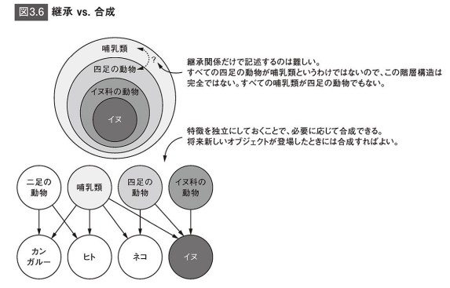

## プロフェッショナルPythonソフトウェアデザインの原則と実践
### 1章: ソフトウェア開発とPython

- デザインはプロセス
  - 「設計(デザイン)」という言葉は、何らかの形になった「結果」を表すことが多いのですが、デザインの価値はその結果に至るまでの「過程(プロセス)」にある
- リファクタリング
  - システムをいくつかのステップに明確に分ける。
    - たとえば、価格に関する処理の全てが1つの大きなかたまりの中で行われている場合、原因を突き止めるために調べるコードが多くなる。
  - 処理ステップの分割を行うことで、各ステップを他と分離できて、他のステップのバグから影響を受ける危険性が下がる。

 

2部: ソフトウェアデザインの基礎

### 2章: 関心の分離
コードの構造化、効率化、テスト

#### ネームスペース
- 他のモジュールからの変数や関数、クラスを利用したいモジュールは、そのグローバルネームスペースにimportしなければならない。
- Pythonで変数、関数、クラスを参照するには、次のいずれかが真でなければならない。

1. 名前がPython組み込みのネームスペースにある
2. 名前が現在のモジュールのグローバルネームスペースにある
3. 名前がコードのローカル・ネームスペースにある

- 名前の衝突があると、上の番号の逆順に優先される。つまり、ローカルな名前がグローバルな名前よりも優先され、またグローバルな名前は組み込みの名前よりも優先される。この結果、最も内部で定義されたものが使われることになる。

#### クラス
- コードは「ビヘイビア(動作)」と「データ」からなっており、開発が進むにつれてこの量が増えていくのが普通。
- しばらくすると、密接に関連している関数がいくつかあることがわかってくる。「関数Aの結果を頻繁に別の関数Bに渡す」、あるいは「同じ入力データを受け取る関数が複数ある」といった場合は、コードを「クラス」にまとめることを検討する。
- クラスを作成するのは、データやビヘイビアの関係がわかっていて、凝集度(クラスのメソッドと属性の関係の強さ)がかなり高くなりそうだと考えられる場合のみ。
- パッケージという言葉にはPythonにおいて2つの意味がある。1つは、モジュール(.pyファイル)を含むディレクトリがパッケージ。`__init__.py`という名前の特別なファイルを置くことで、ディレクトリがパッケージとして扱われる。もう1つは、PyPIからインストールしたサードパーティのPythonライブラリのこと。

 

### 3章: 抽象化とカプセル化
関数、クラス、モジュールといった機構は関心(concern)を分離するための優れた手段である。こうした機構は「コード複雑さ」を分離する目的にも利用である。プログラムの詳細を全て記憶し続けるのは困難であるため、「抽象化」と「カプセル化」を活用する。

#### カプセル化
- カプセル化はオブジェクト指向プログラミングの基本で、分割をもう一歩先に進めたもの。分割が関連するコードを関数にまとめるのに対して、カプセル化は関連する関数とデータをより大規模な単位にまとめ上げる。
- 基本的にPythonではカプセル化のために「クラス」や「モジュール」を用いる。最も大きなカプセル化の単位は「パッケージ」。

#### リファクタリング
- カプセル化や抽象化は反復的なプロセスになるのが一般的である。コードを書き進めるにつれて、以前は良いと思っていたものに違和感が出てくる。そうなってきたら、「リファクタリング」を検討するべきとき。コードのリファクタリングとは、自分のニーズをより効果的に満たすようコードの構造を変化させることである。たとえば、クラス内で必要のないメソッドを独立した関数として分離したりする。

#### プログラミングスタイル(プログラミングパラダイム)
- 手続型プログラミング
  - 「関数」と呼ばれることの多い、手続的な機能の呼び出しが多用される。こうした関数はクラスとしてカプセル化はされていないので、多くの場合、入力(引数)に依存して、また時には大域的(グローバル)な状態に依存して処理を行う。
- 関数型プログラミング
  - サポートはされているが、好まれるアプローチであることは多くない。`map`とか`lambda`を使う無名関数が該当する。パフォーマンス上でメリットが得られる。
- 宣言型プログラミング
  - パラメーターに多少の違いがあるだけのようなタスクを繰り返し実行するといった場合に有用。例として`plotly`で一度にパラメータを渡すのに対して、　手続型では1つ1つのステップを実行していくことになる。

#### 型と継承
Pythonは動的型付け言語で、実行時にデータ型を決定する。また、「ダックタイピング」と呼ばれるシステムも使う。

今日では、オブジェクトの「合成(composition)」を多用する開発者が増えている。合成は分割(decomposition)の逆で、目的とする概念を実現するために、いくつかの機能を付加していくものである。

 

### 4章: パフォーマンスを考慮したデザイン

 

### 5章: ソフトウェアのテスト
- テストの目的
  - その部分が想定通りの動作をしているかを確認すること
  - コードが「どのように動作するべきか」の仕様。だいぶ前に書いたコードの意図を思い出すきっかけにもなる。
  - テストが検証の役目だけでなく、ドキュメントの役目も果たしてくれれば理想的
- テストの種類
  - 手動テスト
    - 自分のプログラムを実行して何らかの入力を与え、その結果が想定と合っているかを自分の目で確認するもの。
    - Webサイトへの登録処理を開発しているなら、ユーザー名とパスワードを入力して新しいユーザーが登録されるかをチェックする。
  - 自動テスト
    - フィードバックループの中に組み込むことで、変更による不具合を素早くチェックできる。
  - 検収テスト
  - 単体テスト
  - 統合テスト
  - リグレッションテスト
- フレームワーク
  - unittest
  - pytest

 

### 6章: 「関心(concern)の分離」の実践